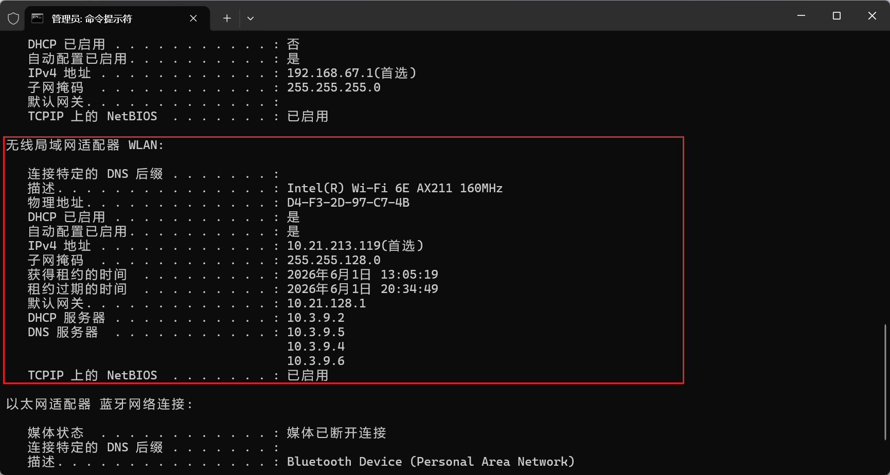

# 计算机网络实验二：IP 和 TCP 数据分组的捕获和解析

## 一、实验基本信息

| 项目       | 内容                           |
| ---------- | ------------------------------ |
| 实验名称   | IP 和 TCP 数据分组的捕获和解析 |
| 实验类别   | 协议分析型                     |
| 实验学时   | 4 学时                         |
| 实验组人数 | 单人 1 组                      |
| 学生姓名   | 杨龙驹                         |
| 学号       | 2024211139                     |
| 班级       | 2024211308                     |
| 实验日期   | 2026.6.1                       |
| 实验地点   | 本地电脑                       |

------

## 二、实验目的

本次实验的主要目的是通过 Wireshark 抓包工具，观察并分析主机连接 Internet 过程中产生的典型网络报文，理解常见网络协议的作用和报文结构。

具体包括：

1. 掌握 Wireshark 的基本使用方法，包括选择网卡、设置过滤器、捕获和查看报文。
2. 捕获并分析 DHCP 报文，理解主机自动获取 IP 地址、默认网关、DNS 等网络参数的过程。
3. 捕获并分析 ARP 报文，理解 IP 地址到 MAC 地址的解析过程。
4. 捕获并分析 ICMP 报文，理解 ping 命令的工作过程。
5. 捕获并分析 IP 数据分组，理解 IPv4 报文的基本格式。
6. 分析长度大于 1500 字节的 IP 数据分组的分片传输过程。
7. 捕获并分析 TCP 连接建立、数据通信和连接拆除的流程。

------

## 三、实验环境

| 项目         | 内容                         |
| ------------ | ---------------------------- |
| 操作系统     | Windows 【待补充具体版本】   |
| 抓包软件     | Wireshark-4.6.6              |
| 网络连接方式 | Wi-Fi（校园网）              |
| 本机 IP 地址 | 10.21.213.119                |
| 子网掩码     | 255.255.128.0                |
| 默认网关     | 10.21.128.1                  |
| DNS 服务器   | 10.3.9.5、10.3.9.4、10.3.9.6 |
| DHCP 服务器  | 10.3.9.2                     |
| 使用网卡     | WLAN                         |
| 网卡型号     | Intel(R) Wi-Fi 6E AX211 160MHz |
| 物理地址     | D4-F3-2D-97-C7-4B            |



------

## 五、实验步骤

### 5.1 Wireshark 准备工作

实验开始前，先启动计算机并连接校园网，确认主机能够正常访问 Internet。随后打开 Wireshark，在网卡列表中选择当前正在使用的 WLAN 无线网卡，并点击开始按钮进行抓包。为确认网卡选择正确，先进行了短时间抓包测试，观察到该网卡上存在实时数据包流量，说明抓包接口选择正确。

实验截图：

> 图 1：Wireshark 网卡选择界面


> 图 2：Wireshark 短抓包测试界面


### 5.2 捕获 DHCP 报文并分析

#### 5.2.1 实验操作过程

在本阶段实验中，首先打开 Wireshark，选择当前正在使用的 `WLAN` 无线网卡作为捕获接口。由于 DHCP 协议基于 UDP 传输，因此在开始捕获时设置捕获过滤器为：

```text
udp
```

开始抓包后，在 Wireshark 顶部的显示过滤器中输入：

```text
udp.port == 68
```

该过滤条件用于显示与 DHCP 客户端端口相关的报文。随后打开 Windows 命令提示符，依次执行以下命令：

```bat
ipconfig /release
ipconfig /renew
```

其中，`ipconfig /release` 用于释放当前已经申请到的 IP 地址，`ipconfig /renew` 用于重新向 DHCP 服务器申请 IP 地址。执行上述命令后，在 Wireshark 中成功捕获到了 DHCP Release、DHCP Discover、DHCP Offer、DHCP Request 和 DHCP ACK 报文。

【插入图 5-2-1：DHCP 报文捕获结果】


------

#### 5.2.2 DHCP 报文捕获结果

从 Wireshark 捕获结果可以看到，主机首先向 DHCP 服务器发送 DHCP Release 报文，释放原先使用的 IP 地址。随后，主机重新开始 DHCP 地址申请过程，依次产生 DHCP Discover、DHCP Offer、DHCP Request 和 DHCP ACK 报文。

本次实验中捕获到的 DHCP 报文如下表所示。

| 序号 | 报文类型      | 源 IP 地址      | 目的 IP 地址      | 源端口 | 目的端口 | Transaction ID | 作用                                |
| ---- | ------------- | --------------- | ----------------- | ------ | -------- | -------------- | ----------------------------------- |
| 39   | DHCP Release  | `10.21.213.119` | `10.3.9.2`        | 68     | 67       | `0x54112bdf`   | 客户端释放原先申请到的 IP 地址      |
| 40   | DHCP Discover | `0.0.0.0`       | `255.255.255.255` | 68     | 67       | `0xf18cd434`   | 客户端广播寻找 DHCP 服务器          |
| 41   | DHCP Offer    | `10.3.9.2`      | `10.21.213.119`   | 67     | 68       | `0xf18cd434`   | DHCP 服务器向客户端提供可用 IP 地址 |
| 42   | DHCP Request  | `0.0.0.0`       | `255.255.255.255` | 68     | 67       | `0xf18cd434`   | 客户端请求使用服务器提供的 IP 地址  |
| 43   | DHCP ACK      | `10.3.9.2`      | `10.21.213.119`   | 67     | 68       | `0xf18cd434`   | DHCP 服务器确认分配该 IP 地址       |

由表中可以看出，DHCP Discover、DHCP Offer、DHCP Request 和 DHCP ACK 四个报文的 Transaction ID 均为 `0xf18cd434`，说明它们属于同一次 DHCP 地址申请过程。

------

#### 5.2.3 DHCP 四次交互过程分析

从抓包结果可以看出，第 40 至第 43 个报文构成了 DHCP 获取 IP 地址的完整四次交互过程。

首先，客户端在尚未获得有效 IP 地址时，以 `0.0.0.0` 作为源 IP 地址，向广播地址 `255.255.255.255` 发送 DHCP Discover 报文。该报文的作用是在当前局域网中寻找可用的 DHCP 服务器。

随后，DHCP 服务器 `10.3.9.2` 向客户端返回 DHCP Offer 报文，为客户端提供一个可用的 IP 地址。从抓包结果可以看到，服务器提供给客户端的地址为 `10.21.213.119`。

接着，客户端再次以 `0.0.0.0` 为源地址，向广播地址 `255.255.255.255` 发送 DHCP Request 报文，表示客户端请求使用 DHCP 服务器提供的 IP 地址。

最后，DHCP 服务器 `10.3.9.2` 向客户端返回 DHCP ACK 报文，确认将 IP 地址 `10.21.213.119` 分配给该客户端。至此，客户端完成 DHCP 地址申请过程，并获得可以用于网络通信的 IP 地址。

------

#### 5.2.4 DHCP ACK 报文字段分析

为了进一步分析 DHCP 服务器下发的网络配置参数，选中第 43 帧 `DHCP ACK` 报文，并展开其中的 `Dynamic Host Configuration Protocol (ACK)` 字段。

在 DHCP ACK 报文中，`Your (client) IP address` 字段为 `10.21.213.119`，表示 DHCP 服务器最终分配给本机的 IPv4 地址。除此之外，DHCP ACK 报文的 Options 字段中还包含 DHCP 服务器地址、IP 地址租约时间、子网掩码、默认网关和 DNS 服务器等参数。这些参数共同构成了主机接入网络后正常通信所需要的基本网络配置。

【插入图 5-2-2：DHCP ACK 报文详细字段】


本次实验中 DHCP ACK 报文的关键字段如下表所示。

| 参数名称        | Wireshark 字段                    | 实验中观察到的值        | 字段作用                                            |
| --------------- | --------------------------------- | ----------------------- | --------------------------------------------------- |
| DHCP 报文类型   | Option 53: DHCP Message Type      | DHCP ACK                | 表示该报文是服务器对客户端地址申请的最终确认        |
| Transaction ID  | Transaction ID                    | `0xf18cd434`            | 用于标识同一次 DHCP 交互过程                        |
| 客户端 IP 地址  | Your (client) IP address          | `10.21.213.119`         | DHCP 服务器分配给本机的 IPv4 地址                   |
| DHCP 服务器地址 | Option 54: DHCP Server Identifier | `10.3.9.2`              | 表示为客户端分配地址的 DHCP 服务器                  |
| IP 地址租约时间 | Option 51: IP Address Lease Time  | 1 hour，即 3600 seconds | 表示该 IP 地址的有效使用时间                        |
| 子网掩码        | Option 1: Subnet Mask             | `255.255.128.0`         | 用于划分网络号和主机号                              |
| 默认网关        | Option 3: Router                  | `10.21.128.1`           | 主机访问其他网络时使用的下一跳路由器地址            |
| DNS 服务器 1    | Option 6: Domain Name Server      | `10.3.9.5`              | 用于将域名解析为 IP 地址                            |
| DNS 服务器 2    | Option 6: Domain Name Server      | `10.3.9.4`              | 备用 DNS 服务器                                     |
| DNS 服务器 3    | Option 6: Domain Name Server      | `10.3.9.6`              | 备用 DNS 服务器                                     |
| Relay Agent IP  | Relay agent IP address            | `10.21.128.1`           | DHCP 中继代理地址，用于在不同网络之间转发 DHCP 报文 |
| 客户端 MAC 地址 | Client MAC address                | `d4:f3:2d:97:c7:4b`     | 用于标识发起 DHCP 请求的客户端网卡                  |

------

#### 5.2.5 DHCP 字段结果核对

为了验证 DHCP ACK 报文中下发的网络配置是否被本机成功采用，在 Windows 命令提示符中执行 `ipconfig /renew` 后，查看 WLAN 无线网卡的网络配置。命令行输出结果显示，本机 WLAN 网卡获得的 IPv4 地址为 `10.21.213.119`，子网掩码为 `255.255.128.0`，默认网关为 `10.21.128.1`。

【插入图 5-2-3：ipconfig /renew 后 WLAN 网络配置结果】


将命令行结果与 Wireshark 中 DHCP ACK 报文的字段进行对比，可以得到如下结果。

| 对比项目  | DHCP ACK 报文中的值 | `ipconfig /renew` 后系统显示的值 | 是否一致 |
| --------- | ------------------- | -------------------------------- | -------- |
| IPv4 地址 | `10.21.213.119`     | `10.21.213.119`                  | 一致     |
| 子网掩码  | `255.255.128.0`     | `255.255.128.0`                  | 一致     |
| 默认网关  | `10.21.128.1`       | `10.21.128.1`                    | 一致     |

由此可见，DHCP 服务器下发的网络配置参数已经被 Windows 主机成功接收并应用。

------

#### 5.2.6 本节小结

通过本阶段实验，成功捕获并分析了 DHCP 报文。实验中主机首先发送 DHCP Release 报文释放原有 IP 地址，随后通过 DHCP Discover、DHCP Offer、DHCP Request 和 DHCP ACK 四次交互重新获得 IP 地址。

本次实验中，客户端最终获得的 IP 地址为 `10.21.213.119`，DHCP 服务器地址为 `10.3.9.2`，子网掩码为 `255.255.128.0`，默认网关为 `10.21.128.1`，DNS 服务器为 `10.3.9.5`、`10.3.9.4` 和 `10.3.9.6`。这些信息说明 DHCP 协议不仅能够自动分配 IP 地址，还能够同时为主机配置默认网关、DNS 服务器和租约时间等网络参数，从而使主机能够正常接入网络并访问 Internet。

—

### 5.3 捕获 ARP 和 ICMP 报文并分析

#### 5.3.1 实验操作过程

在完成 DHCP 报文捕获和分析后，重新设置 Wireshark 的捕获选项和显示选项。本阶段实验仍然选择当前正在使用的 `WLAN` 无线网卡作为捕获接口。为了避免遗漏 ARP 和 ICMP 报文，本次抓包不再设置捕获过滤器，开始抓包后在 Wireshark 顶部的显示过滤器中输入：

```text
arp || icmp
```

该过滤器用于同时显示 ARP 报文和 ICMP 报文。

随后在 Windows 命令提示符中执行 ping 命令，对默认网关 `10.21.128.1` 进行连通性测试：

```bat
ping -4 10.21.128.1
```

命令执行结果显示，主机共发送 4 个 ICMP 请求报文，收到 4 个 ICMP 响应报文，丢包率为 0%，说明本机与默认网关之间网络连通正常。

【插入图 5-3-1：ping 命令执行结果】

------

#### 5.3.2 ARP 和 ICMP 报文捕获结果

执行 ping 命令后，在 Wireshark 中使用 `arp || icmp` 显示过滤器观察相关报文。抓包结果中可以看到 ICMP Echo Request、ICMP Echo Reply 以及 ARP Request、ARP Reply 等报文。

【插入图 5-3-2：Wireshark 中 ARP 和 ICMP 报文捕获结果】

本次实验中捕获到的典型报文如下表所示。

| 序号 | 协议 | 源地址          | 目的地址        | 报文信息                                    | 作用                                    |
| ---- | ---- | --------------- | --------------- | ------------------------------------------- | --------------------------------------- |
| 8    | ICMP | `10.21.213.119` | `10.21.128.1`   | Echo Request                                | 本机向默认网关发送 ping 请求            |
| 9    | ICMP | `10.21.128.1`   | `10.21.213.119` | Echo Reply                                  | 默认网关向本机返回 ping 响应            |
| 196  | ARP  | `10.21.128.1`   | `10.21.213.119` | Who has `10.21.213.119`? Tell `10.21.128.1` | 默认网关查询本机 IP 地址对应的 MAC 地址 |
| 197  | ARP  | `10.21.213.119` | `10.21.128.1`   | `10.21.213.119` is at `d4:f3:2d:97:c7:4b`   | 本机返回自身 IP 地址对应的 MAC 地址     |

从表中可以看出，本机通过 ICMP 报文完成了与默认网关之间的连通性测试；同时，默认网关也通过 ARP 报文查询并确认了本机 IP 地址 `10.21.213.119` 对应的 MAC 地址。

------

#### 5.3.3 ICMP 报文分析

在 Wireshark 中选中第 8 帧 ICMP Echo Request 报文，并展开 Ethernet II、Internet Protocol Version 4 和 Internet Control Message Protocol 字段，可以看到该报文从本机 `10.21.213.119` 发往默认网关 `10.21.128.1`。

【插入图 5-3-3：ICMP Echo Request 报文详细字段】

本次 ICMP Echo Request 报文的关键字段如下表所示。

| 字段名称        | 实验中观察到的值       | 字段含义                           |
| --------------- | ---------------------- | ---------------------------------- |
| 源 MAC 地址     | `d4:f3:2d:97:c7:4b`    | 本机 WLAN 网卡的 MAC 地址          |
| 目的 MAC 地址   | `10:4f:58:6c:24:00`    | 默认网关对应的 MAC 地址            |
| 源 IP 地址      | `10.21.213.119`        | 本机 IPv4 地址                     |
| 目的 IP 地址    | `10.21.128.1`          | 默认网关 IPv4 地址                 |
| IP 头部长度     | 20 bytes               | IPv4 头部长度                      |
| IP 总长度       | 60 bytes               | 当前 IP 数据报总长度               |
| TTL             | 128                    | 报文生存时间                       |
| 上层协议        | ICMP，协议号为 1       | 表示 IP 数据部分承载的是 ICMP 报文 |
| ICMP 类型       | Echo Request，Type = 8 | 表示该报文为 ping 请求报文         |
| ICMP Code       | 0                      | Echo Request 报文的代码字段        |
| Sequence Number | 5                      | ICMP 请求报文序号                  |
| Data Length     | 32 bytes               | ping 命令默认携带的数据长度        |

随后默认网关 `10.21.128.1` 返回 ICMP Echo Reply 报文，说明目标主机收到请求并成功返回响应。因此，ping 命令中的 4 次请求均得到响应，丢包率为 0%。

本次 ICMP 报文交换过程可以概括为：

```text
10.21.213.119  ->  10.21.128.1    ICMP Echo Request
10.21.128.1    ->  10.21.213.119  ICMP Echo Reply
```

这说明本机与默认网关之间的三层 IP 连通性正常。

------

#### 5.3.4 ARP 报文分析

ARP 协议用于根据 IP 地址查询对应的 MAC 地址。在局域网通信中，主机虽然通过 IP 地址确定通信目标，但实际在以太网链路上传输数据帧时仍然需要使用 MAC 地址。因此，在发送或接收局域网内的 IP 数据报时，主机需要通过 ARP 建立 IP 地址与 MAC 地址之间的映射关系。

本次实验中，在 Wireshark 中捕获到了 ARP Request 和 ARP Reply 报文。其中第 196 帧为 ARP Request，内容为：

```text
Who has 10.21.213.119? Tell 10.21.128.1
```

这表示默认网关 `10.21.128.1` 正在查询谁拥有 IP 地址 `10.21.213.119`。第 197 帧为 ARP Reply，内容为：

```text
10.21.213.119 is at d4:f3:2d:97:c7:4b
```

这表示本机回复默认网关，说明 IP 地址 `10.21.213.119` 对应的 MAC 地址为 `d4:f3:2d:97:c7:4b`。

【插入图 5-3-4：ARP Reply 报文详细字段】

本次 ARP 报文的关键字段如下表所示。

| 序号 | 报文类型    | 源 MAC 地址         | 目的 MAC 地址       | 发送方 IP 地址  | 目标 IP 地址    | 作用                                |
| ---- | ----------- | ------------------- | ------------------- | --------------- | --------------- | ----------------------------------- |
| 196  | ARP Request | `10:4f:58:6c:24:00` | `d4:f3:2d:97:c7:4b` | `10.21.128.1`   | `10.21.213.119` | 默认网关查询本机 IP 对应的 MAC 地址 |
| 197  | ARP Reply   | `d4:f3:2d:97:c7:4b` | `10:4f:58:6c:24:00` | `10.21.213.119` | `10.21.128.1`   | 本机返回自己的 MAC 地址             |

在第 197 帧 ARP Reply 报文中，`Address Resolution Protocol (reply)` 字段显示：

| 字段名称           | 实验中观察到的值    | 字段含义                      |
| ------------------ | ------------------- | ----------------------------- |
| Hardware type      | Ethernet (1)        | 硬件类型为以太网              |
| Protocol type      | IPv4 (0x0800)       | 协议类型为 IPv4               |
| Hardware size      | 6                   | MAC 地址长度为 6 字节         |
| Protocol size      | 4                   | IPv4 地址长度为 4 字节        |
| Opcode             | reply (2)           | 表示该 ARP 报文为响应报文     |
| Sender MAC address | `d4:f3:2d:97:c7:4b` | 发送方，即本机的 MAC 地址     |
| Sender IP address  | `10.21.213.119`     | 发送方，即本机的 IP 地址      |
| Target MAC address | `10:4f:58:6c:24:00` | 目标方，即默认网关的 MAC 地址 |
| Target IP address  | `10.21.128.1`       | 目标方，即默认网关的 IP 地址  |

由此可以看出，ARP 报文完成了 IP 地址到 MAC 地址的映射确认过程，使默认网关能够根据本机的 IP 地址找到对应的链路层 MAC 地址。

------

#### 5.3.5 本节小结

通过本阶段实验，成功捕获并分析了 ARP 和 ICMP 报文。ICMP 部分表明，本机 `10.21.213.119` 能够成功向默认网关 `10.21.128.1` 发送 Echo Request 报文，并收到 Echo Reply 响应，说明本机与默认网关之间的 IP 连通性正常。

ARP 部分表明，默认网关 `10.21.128.1` 通过 ARP Request 查询本机 IP 地址 `10.21.213.119` 对应的 MAC 地址，本机随后通过 ARP Reply 返回自己的 MAC 地址 `d4:f3:2d:97:c7:4b`。该过程说明 ARP 协议在局域网通信中负责完成 IP 地址到 MAC 地址的解析，为后续 IP 数据报在以太网中的传输提供了必要的链路层地址信息。

